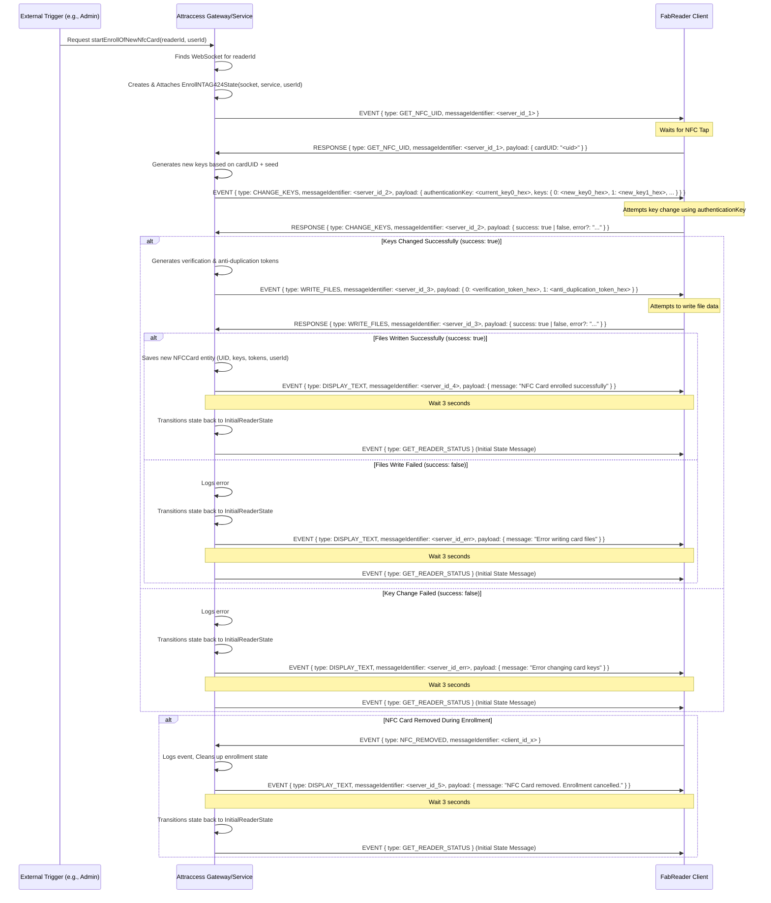

# NTAG424 DNA Card Enrollment Flow (`EnrollNTAG424State`)

This document details the process for enrolling a new NTAG424 DNA NFC card for a user within the FabReader system. This state (`EnrollNTAG424State`) manages the communication between the server and the reader client during enrollment.

**Key Characteristics:**

- **Server-Initiated:** The enrollment process is **not** started by the reader connecting. It must be triggered by an external action on the server (e.g., an administrator using a UI).
- **Stateful:** The reader client enters a specific `EnrollNTAG424State` for the duration of the enrollment.
- **Targeted:** Enrollment is always associated with a specific `readerId` and `userId`.

## Initiation

1.  An external trigger (e.g., Admin UI) calls the `fabreaderGateway.startEnrollOfNewNfcCard({ readerId, userId })` method on the server.
2.  The server locates the WebSocket connection associated with the `readerId`.
3.  The server instantiates `EnrollNTAG424State`, linking it to the specific socket, service, and `userId`.
4.  The server transitions the client's state to `EnrollNTAG424State`.
5.  The server sends the initial `GET_NFC_UID` event to the client, starting the flow.

## Enrollment Sequence Diagram

## Communication Flow Details

The communication relies on `EVENT` messages (Server -> Client) and `RESPONSE` messages (Client -> Server). Each message pair is linked by a `messageIdentifier`.

1.  **Get NFC UID**

    - **Server -> Client:** `EVENT { type: GET_NFC_UID }`
      - Instructs the client to wait for an NFC card tap and report its unique identifier (UID).
    - **Client -> Server:** `RESPONSE { type: GET_NFC_UID, payload: { cardUID: "<string>" } }`
      - Client sends the UID of the tapped card.

2.  **Change Card Keys**

    - **Server -> Client:** `EVENT { type: CHANGE_KEYS, payload: { authenticationKey: <hex_string>, keys: { <key_no>: <hex_string>, ... } } }`
      - `authenticationKey`: The _current_ Key 0 (Master Key) of the card, represented as a hex string. This is needed to authorize key changes. If the card is new or unknown, the server might send the default NTAG424 key (all zeros).
      - `keys`: An object where keys are key numbers (0-4) and values are the _new_ key values (hex strings) to be written to the card. The server generates these new keys.
    - **Client -> Server:** `RESPONSE { type: CHANGE_KEYS, payload: { success: <boolean>, error?: "<string>" } }`
      - Reports whether the key changing operation succeeded or failed. Provides an error message on failure.

3.  **Write Files**

    - **Server -> Client:** `EVENT { type: WRITE_FILES, payload: { <file_id>: <hex_string>, ... } }`
      - Instructs the client to write data to specific standard data files on the card. Authentication happens implicitly using the _newly set_ keys from the previous step.
      - `file_id`: The file number to write to (e.g., `0` for verification token, `1` for anti-duplication token).
      - `hex_string`: The data to write, represented as a hex string. The server generates these tokens.
    - **Client -> Server:** `RESPONSE { type: WRITE_FILES, payload: { success: <boolean>, error?: "<string>" } }`
      - Reports whether the file writing operation succeeded or failed. Provides an error message on failure.

4.  **Display Text (Feedback)**
    - **Server -> Client:** `EVENT { type: DISPLAY_TEXT, payload: { message: "<string>" } }`
      - Used to show feedback messages to the user via the reader's display (e.g., success, failure, card removed).

## Alternative Flows / Error Handling

- **NFC Card Removed:**
  - **Client -> Server:** `EVENT { type: NFC_REMOVED }`
    - If the client detects the NFC card is removed at _any point_ during the `EnrollNTAG424State`, it sends this event.
  - **Server Action:** The server logs the event, cancels the enrollment process, cleans up any temporary enrollment data, displays a "Card removed" message on the client, and transitions the client back to the `InitialReaderState` after a short delay.
- **Key Change Fails:** If the client responds with `success: false` for `CHANGE_KEYS`, the server logs the error, cancels enrollment, optionally displays an error message, and transitions back to `InitialReaderState`.
- **File Write Fails:** If the client responds with `success: false` for `WRITE_FILES`, the server logs the error, cancels enrollment, optionally displays an error message, and transitions back to `InitialReaderState`.

## Completion

- **Success:** If all steps (`GET_NFC_UID`, `CHANGE_KEYS`, `WRITE_FILES`) complete successfully, the server saves the new `NFCCard` entity to the database, associating it with the `userId`. It sends a success message to the client (`DISPLAY_TEXT`), waits briefly, and then transitions the client back to the `InitialReaderState`.
- **Failure/Cancellation:** In case of errors or card removal, the enrollment is aborted, and the client is returned to the `InitialReaderState` after appropriate feedback and cleanup.
