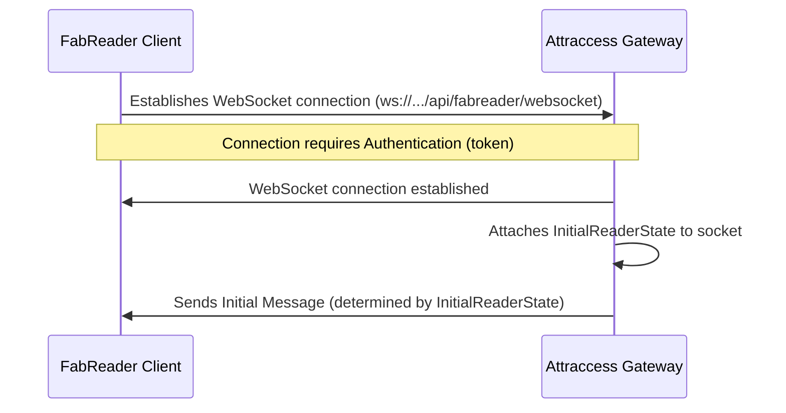
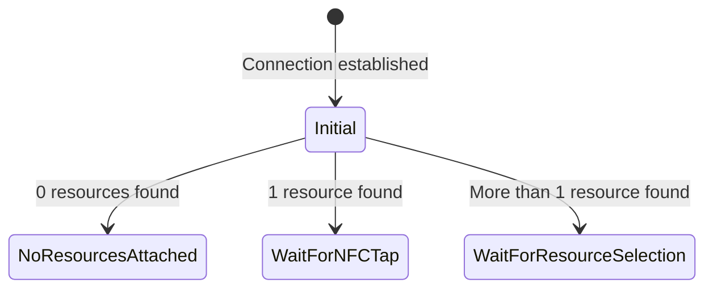
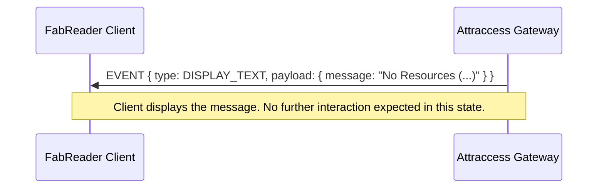
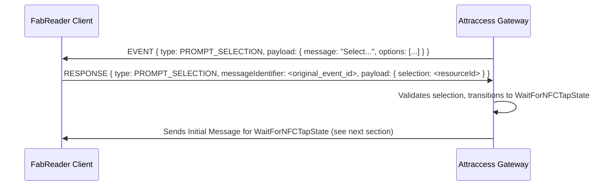
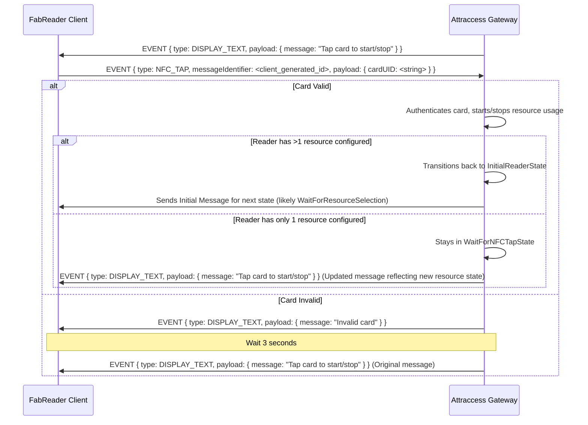

# FabReader WebSocket Communication Flow

This document outlines the communication protocol between the FabReader hardware client and the Attraccess backend via WebSocket.

## Connection Establishment and Initialization

The communication starts when the FabReader client establishes a WebSocket connection to the server endpoint.

**Endpoint:** `/api/fabreader/websocket`

**Authentication:** The connection requires authentication. The client must provide a valid token obtained through the registration process (see [Reader Registration](#reader-registration)). Authentication details are likely handled during the WebSocket upgrade request, but specifics are managed by the `WsAuthGuard`.

**Initial State:** Upon successful connection and authentication, the server attaches an `InitialReaderState` to the socket and sends an initial message to the client.



## Initial State Logic (`InitialReaderState`)

The server determines the reader's configuration upon connection.

1.  **Fetch Reader Resources:** The server fetches resources associated with the connected reader.
2.  **Transition:** Based on the number of resources found:
    - **Zero Resources:** Transitions to `NoResourcesAttachedState`.
    - **One Resource:** Transitions to `WaitForNFCTapState`.
    - **Multiple Resources:** Transitions to `WaitForResourceSelectionState`.



The specific message sent to the client upon connection depends on the state transitioned _into_.

## State: `NoResourcesAttachedState`

This state is entered when the connected reader is not associated with any resources in the system.

**Initial Message (Server -> Client):**

- **Type:** `EVENT`
- **Event Type:** `DISPLAY_TEXT`
- **Payload:** `{ message: string }` (e.g., `{ message: "No Resources (ID: ReaderName)" }`)

**Flow:**



## State: `WaitForResourceSelectionState`

This state is entered when the connected reader is associated with multiple resources, requiring the user to select one.

**Initial Message (Server -> Client):**

- **Type:** `EVENT`
- **Event Type:** `PROMPT_SELECTION`
- **Payload:** `{ message: string, options: Array<{ label: string, value: number }> }`
  - `message`: e.g., "Select a resource"
  - `options`: List of resources the reader can access.
    - `label`: Resource name (for display).
    - `value`: Resource ID (to be sent back in response).

**Flow:**



- The client should display the `message` and `options` to the user.
- When the user selects an option, the client sends a `RESPONSE` message back, echoing the `type` (`PROMPT_SELECTION`) and including the `messageIdentifier` from the original `EVENT`. The `payload` contains the `value` (resource ID) of the selected option under the key `selection`.
- If the selection is invalid, the server may close the connection.

## State: `WaitForNFCTapState`

This state is entered when the reader is ready to interact with a single, specific resource (either because it only had one resource initially, or one was selected in the previous state). It waits for a user to tap an NFC card.

**Initial Message (Server -> Client):**

- **Type:** `EVENT`
- **Event Type:** `DISPLAY_TEXT`
- **Payload:** `{ message: string }`
  - The message indicates the action that will occur upon tapping (e.g., "Tap your card to start" or "Tap your card to stop"). This depends on whether the resource is currently in use.

**Flow:**



- The client waits for an NFC tap event from its hardware.
- When a tap occurs, the client sends an `EVENT` message with `type: NFC_TAP` and the `cardUID` in the payload.
- The server processes the tap:
  - **Invalid Card:** Sends a temporary "Invalid card" message, then resends the original "Tap card..." message.
  - **Valid Card:** Starts or stops the resource usage session. Then, either transitions back to the initial state (if multiple resources are available for the reader) or sends an updated "Tap card..." message reflecting the new resource status.

## General Message Structure

All messages exchanged follow a common structure. Although the specific types `FabreaderEvent` and `FabreaderResponse` are used in the code, from the client's perspective, they are JSON objects sent/received over the WebSocket.

**Server -> Client (Events):**

```json
{
  "type": "EVENT",
  "data": {
    "messageIdentifier": "server-generated-uuid-or-timestamp",
    "type": "<FabreaderEventType>", // e.g., DISPLAY_TEXT, PROMPT_SELECTION
    "payload": { ... } // Varies depending on Event Type
  }
}
```

**Client -> Server (Events):**

```json
{
  "type": "EVENT",
  "data": {
    "messageIdentifier": "client-generated-uuid-or-timestamp",
    "type": "<FabreaderEventType>", // e.g., NFC_TAP
    "payload": { ... }
  }
}
```

**Client -> Server (Responses):**

```json
{
  "type": "RESPONSE",
  "data": {
    "messageIdentifier": "<messageIdentifier from original EVENT>",
    "type": "<FabreaderEventType from original EVENT>", // e.g., PROMPT_SELECTION
    "payload": { ... } // Response payload, e.g., { selection: ... }
  }
}
```

_Note: The exact top-level structure (`{ "type": "EVENT"/"RESPONSE", "data": ... }`) might need verification based on how `@SubscribeMessage` and the gateway handle nesting. The important parts are `messageIdentifier`, `type` (within `data`), and `payload`._

_(See [NTAG424 Enrollment Flow](./ntag424_enrollment_flow.md) and Registration for details)_
