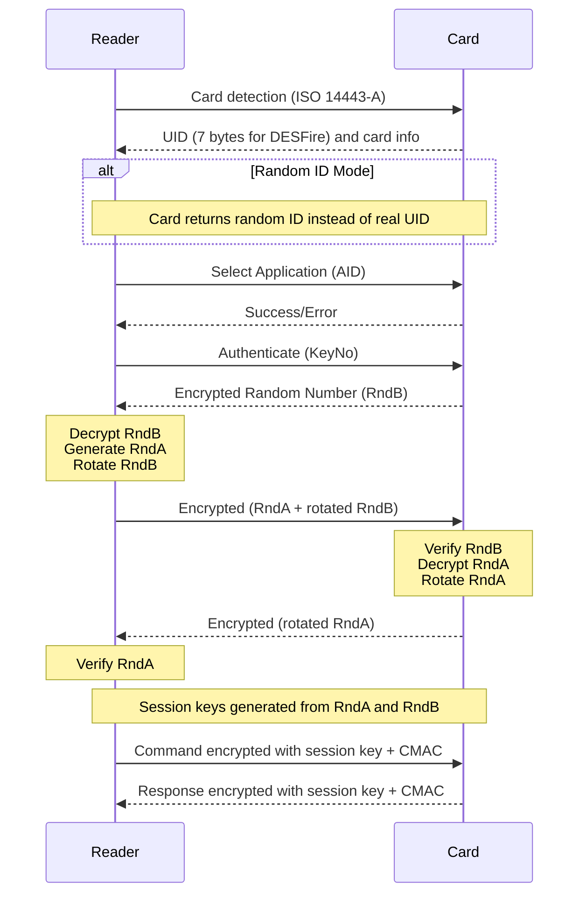
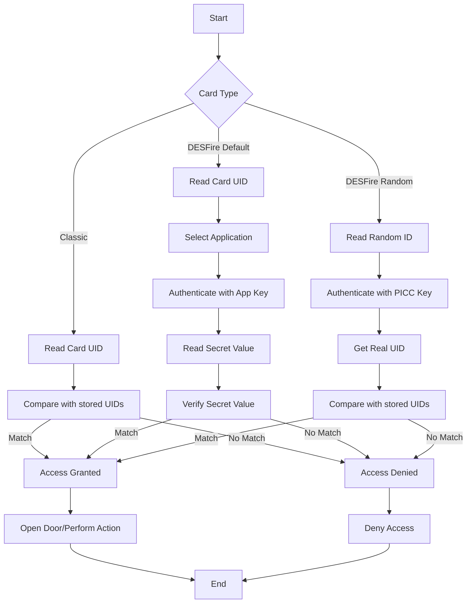
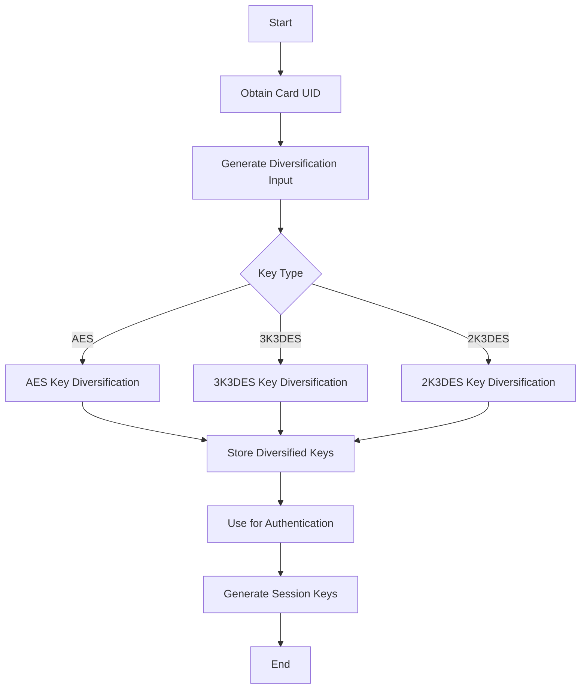

# DESFire Authentication Process in Detail

This document provides a detailed breakdown of the DESFire authentication process, including the sequence of operations, cryptographic functions, and security mechanisms.

## Authentication Sequence

The DESFire authentication is a complex process that establishes a secure session between the reader and the card. Below is the detailed sequence diagram representing the authentication flow.

## Authentication Process Steps in Detail

1. **Card Detection and UID Retrieval**

   - Reader activates RF field and detects ISO 14443-A cards
   - Card responds with its UID (7 bytes for DESFire) and card information
   - In Random ID Mode, the card returns a different random ID each time

2. **Application Selection**

   - Reader sends Select Application command with the Application ID (AID)
   - Card responds with success if the application exists or error if it doesn't

3. **Authentication Initiation**

   - Reader sends Authenticate command with the key number (KeyNo)
   - Card generates a random number (RndB), encrypts it with the specified key, and sends it to the reader

4. **Challenge Exchange**

   - Reader decrypts RndB using the same key
   - Reader generates its own random number (RndA)
   - Reader rotates RndB (shift left by 8 bits)
   - Reader encrypts the concatenation of RndA and rotated RndB
   - Reader sends this encrypted value to the card

5. **Authentication Verification**

   - Card decrypts the received data
   - Card verifies that the rotated RndB matches
   - Card rotates RndA (shift left by 8 bits)
   - Card encrypts the rotated RndA and sends it to the reader
   - Reader decrypts and verifies the rotated RndA

6. **Session Key Generation**

   - Both the reader and card independently generate session keys from RndA and RndB
   - Different session keys are generated for encryption and CMAC calculation
   - For AES: Session key is derived from first 8 bytes of RndA and first 8 bytes of RndB
   - For 3K3DES: Three different keys are derived using different parts of RndA and RndB

7. **Secure Communication**
   - All subsequent commands are encrypted with the session key
   - Commands include a Message Authentication Code (CMAC) to ensure integrity
   - Responses are also encrypted and include CMAC
   - The encryption uses Cipher Block Chaining (CBC) mode with an initialization vector (IV)
   - The IV is updated after each command/response

## Encryption Modes and CMAC

DESFire uses different encryption methods depending on the key type:

1. **DES/2K3DES/3K3DES**

   - Uses CBC mode for encryption/decryption
   - CMAC is calculated using a variant of CBC-MAC

2. **AES**
   - Uses CBC mode for encryption/decryption
   - CMAC is calculated using CMAC algorithm (RFC 4493)

The IV (initialization vector) is critical for secure communication:

- Initial IV is all zeros after authentication
- For subsequent commands, the IV is the last ciphertext block of the previous operation
- Different IVs are maintained for command and response directions

## Key Diversification

For added security, DESFire implementations typically use key diversification:

1. The master keys stored in the reader system are never directly used for authentication
2. Instead, for each card, unique diversified keys are derived using:
   - Card UID
   - Application data (like user ID)
   - Additional random data
3. This ensures that if one card's keys are compromised, other cards remain secure

## DESFire Security Architecture Flowchart

Below is a flowchart illustrating the DESFire security architecture:

## Key Handling Process

## PN532 Communication Protocol

The article describes using the PN532 NFC controller for communicating with DESFire cards. The communication protocol between the microcontroller and the PN532 is complex:

1. Host sends Data Write (DW) byte
2. Host sends command frame
3. Host sends Status Read (SR) byte
4. PN532 responds with status (ready/not ready)
5. Host sends Data Read (DR) byte
6. PN532 sends ACK frame
7. Host sends Status Read (SR) byte
8. PN532 responds with status
9. Host sends Data Read (DR) byte
10. PN532 sends response frame

This low-level protocol handles the communication between the host controller and the NFC reader chip, which in turn communicates with the DESFire card.
