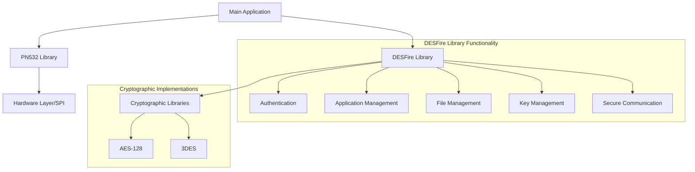
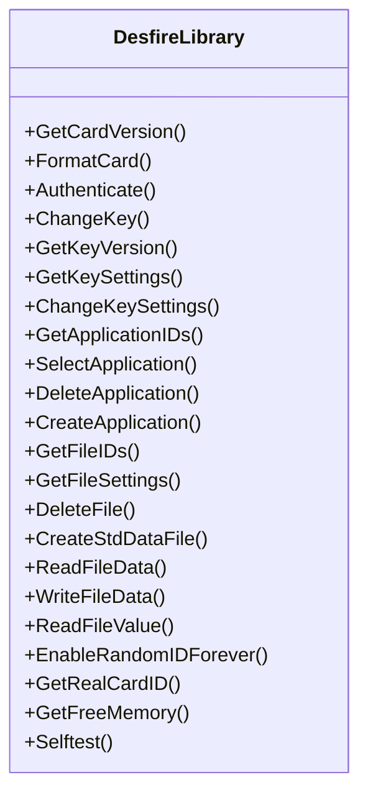
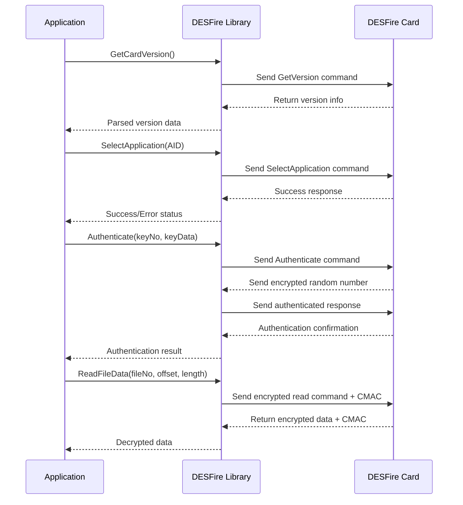

# DESFire Library Implementation

This document details the implementation of a DESFire library for microcontrollers as described in the article. According to the author, this was the first DESFire library ever written for Arduino/Teensy platforms.

## Library Architecture

## Core Components

1. **PN532 Communication Library**

   - Completely rewritten from the Adafruit library to fix numerous bugs
   - Implements the complex PN532 communication protocol
   - Supports three communication modes:
     - Software SPI (recommended for long cables, runs at 10kHz)
     - Hardware SPI (limited by Teensy pin arrangement)
     - I2C (not recommended for long cables)
   - Handles error recovery and chip reset functionality

2. **DESFire Library**

   - Approximately 2700 lines of code
   - Manages the DESFire card functionality
   - Handles authentication, key management, application management, and file operations
   - Implements the cryptographic operations required for DESFire

3. **Cryptographic Libraries**
   - AES-128 implementation from Texas Instruments
   - 3DES implementation from Eric Young
   - Carefully selected for small code size while maintaining security

## Library Size and Efficiency

- Total code size when compiled for Mifare Classic: 18% of flash memory
- Total code size when compiled for DESFire: 27% of flash memory
- Cryptographic operations add only 9% to the total flash memory usage
- Carefully optimized to run on microcontrollers with limited resources

## Key DESFire Library Functions

### Core Functions Explained

1. **Card Information**

   - `GetCardVersion()`: Obtains details about the DESFire card (hardware/software version, EEPROM size, production info)
   - `GetFreeMemory()`: Returns remaining free memory in the card's EEPROM

2. **Security Functions**

   - `Authenticate()`: Authenticates with a 2K3DES, 3K3DES, or AES key at PICC or application level
   - `ChangeKey()`: Changes the PICC master key or any application key
   - `GetKeyVersion()`: Retrieves the key version
   - `GetKeySettings()`: Gets key settings (permissions)
   - `ChangeKeySettings()`: Changes key settings

3. **Application Management**

   - `CreateApplication()`: Creates a new application with specified key types
   - `DeleteApplication()`: Deletes an application with all its files and keys
   - `SelectApplication()`: Selects an application for subsequent commands
   - `GetApplicationIDs()`: Lists all applications on the card

4. **File Operations**

   - `CreateStdDataFile()`: Creates a standard data file with defined size
   - `ReadFileData()`: Reads data from a file
   - `WriteFileData()`: Writes data to a file
   - `ReadFileValue()`: Reads value from a value file
   - `DeleteFile()`: Deletes a file
   - `GetFileIDs()`: Lists all files in an application
   - `GetFileSettings()`: Gets information about a file

5. **Special Functions**
   - `FormatCard()`: Erases all content except the PICC master key
   - `EnableRandomIDForever()`: Permanently enables random ID mode
   - `GetRealCardID()`: Retrieves real card UID (useful in random ID mode)
   - `Selftest()`: Tests all library functions on an empty card

## Implementation Challenges

The author highlighted several challenges in implementing the DESFire library:

1. **Lack of Documentation**

   - NXP requires an NDA for complete DESFire documentation
   - Implementation required studying open-source projects and extensive experimentation

2. **Complex Authentication**

   - Exchange of encrypted random values
   - Generation of session keys
   - Maintaining correct IV (initialization vector)

3. **Cipher Block Chaining**

   - Proper maintenance of encryption IVs
   - Different modes for send/receive operations

4. **Message Authentication Code**

   - Implementation of CMAC for command integrity
   - Different implementation for different key types

5. **Key Changes**
   - Complex procedure involving CRC32 calculations
   - XORing, padding, and encrypting keys with session key

## Design Decisions

1. **No Dynamic Memory Allocation**

   - The library completely avoids the `new` operator
   - All memory is statically allocated
   - Makes the library more reliable for embedded systems

2. **Optimized Communication**

   - RF field is activated only when needed (100ms) and turned off for 1 second periods
   - Reduces average power consumption from 110mA to approximately 26mA

3. **Error Recovery**
   - Built-in error handling and recovery mechanisms
   - Handles timeout errors when the card is too far from the antenna
   - Self-healing mechanisms for communication errors

## Usage Example (Simplified)

## Error Handling

The library includes comprehensive error handling:

1. **Timeout Errors**

   - Occur when the card is too far from the antenna
   - More frequent with AES authentication (higher power consumption)
   - Library resets communication by turning off RF field

2. **Communication Errors**

   - Automatically resets the PN532 chip
   - Reinitializes communication

3. **Integrity Errors**
   - Detects when CMAC verification fails
   - Indicates potential tampering or communication problems

The library's robust error handling ensures reliable operation even in challenging conditions.
