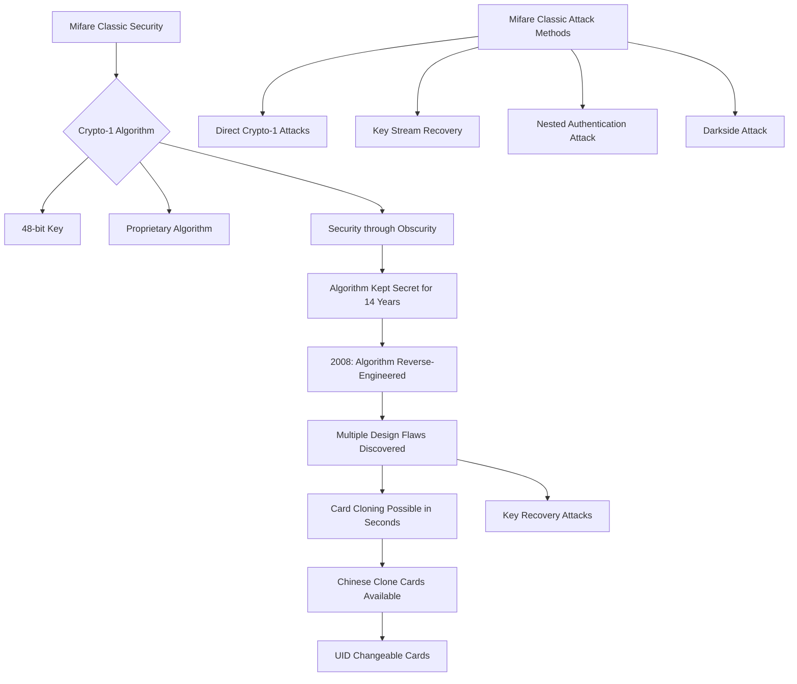
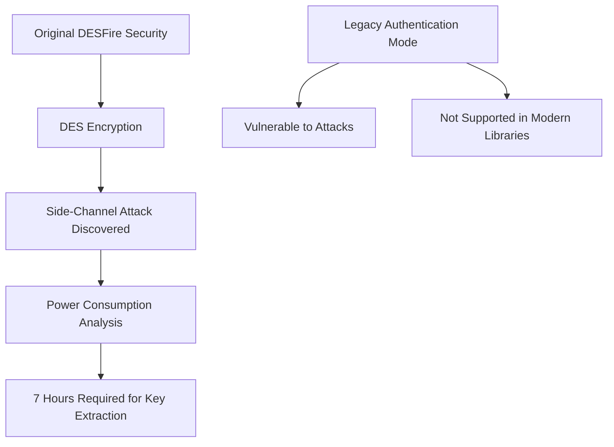
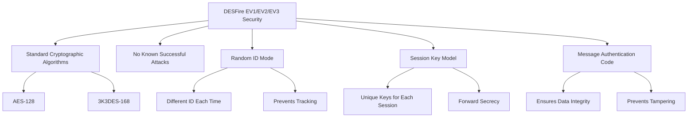
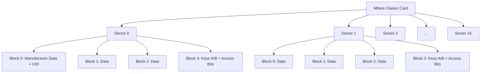
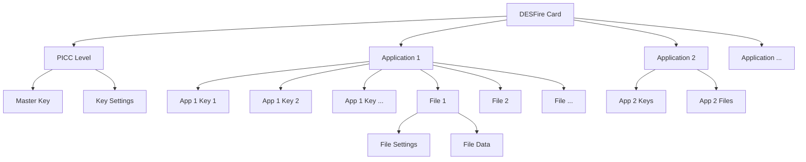
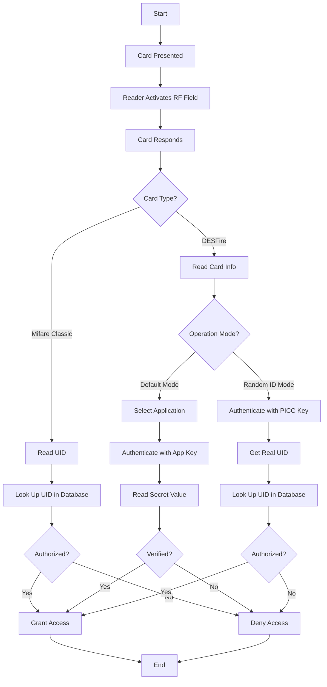
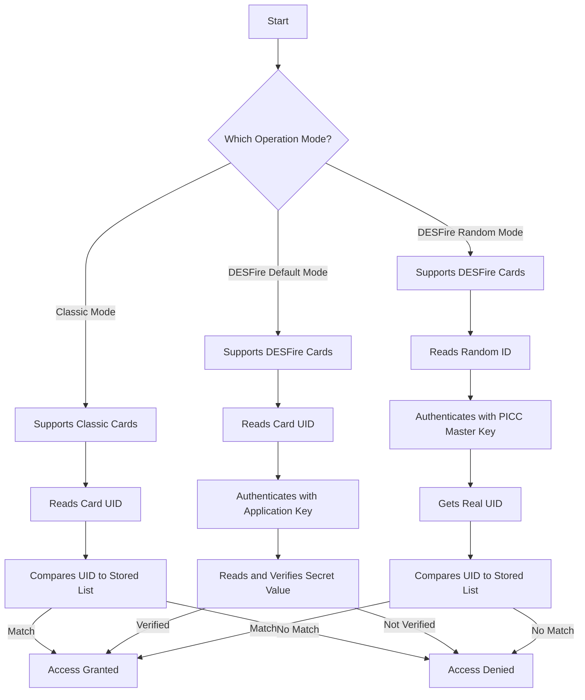
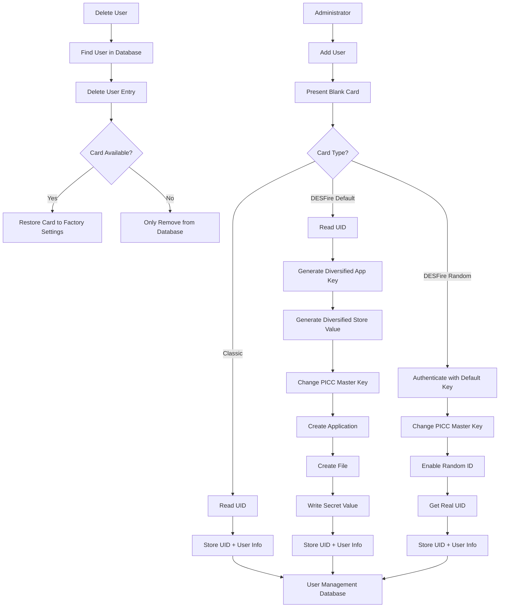

# Mifare Classic vs. DESFire Comparison

This document provides a detailed comparison between Mifare Classic and DESFire card technologies, focusing on security, structure, and functionality.

## Side-by-Side Comparison

| Feature                  | Mifare Classic                                                                                    | Mifare DESFire EV1/EV2/EV3                                                                                  |
| ------------------------ | ------------------------------------------------------------------------------------------------- | ----------------------------------------------------------------------------------------------------------- |
| **Unique Identifier**    | 4 bytes UID can always be read without encryption                                              | 7 bytes UID can be read without encryption in default mode Requires PICC master key in random ID mode |
| **EEPROM Storage**       | On a 1kB card: 16 sectors of 4 blocks of 16 bytes each (Blocks and sectors have fixed size) | Up to 28 applications Each application can contain up to 32 files Files have variable size            |
| **Keys**                 | Each sector protected with two keys (A and B) Different permissions per key                    | Each application protected with up to 14 different keys Different permissions per key                    |
| **Encryption**           | Proprietary (Crypto-1, 48 bit)                                                                    | DES (56 bit) 2K3DES (112 bit) 3K3DES (168 bit) AES (128 bit)                                       |
| **Security Status**      | Encryption cracked in 2008 Cards can be cloned in seconds                                      | No known attacks Side-channel attack on original DESFire (not EV1/EV2/EV3)                               |
| **Card Structure**       | Static organization with fixed sectors and blocks                                                 | Dynamic with applications and files                                                                         |
| **Read Distance**        | Up to 10cm with proper antenna                                                                    | DES: Up to 5.3cm AES: Up to 4.0cm (Distance depends on power consumption)                             |
| **Authentication**       | Simple sector-based key authentication                                                            | Complex cryptographic authentication with session keys                                                      |
| **Cloning Protection**   | None (easily cloned)                                                                              | Strong protection through advanced encryption                                                               |
| **ID Randomization**     | Not available                                                                                     | Available (Random ID mode)                                                                                  |
| **Key Diversification**  | Not supported natively                                                                            | Fully supported                                                                                             |
| **Standards Compliance** | Proprietary                                                                                       | ISO/IEC 14443-4                                                                                             |

## Security Vulnerabilities

### Mifare Classic

### DESFire Original (Pre-EV1)

### DESFire EV1/EV2/EV3

## Memory Structure Visualization

### Mifare Classic Memory Structure

### DESFire Memory Structure

## Access Control System Architecture

## Data Flow in Operation Modes

## Key Management Workflow

## Countermeasure Recommendations

### For Mifare Classic Users

1. **Migrate to DESFire** - The only truly secure option
2. **RFID Blocking Wallet** - Prevent unauthorized card reading
3. **Regular Monitoring** - Check access logs frequently
4. **Secondary Authentication** - Combine with PIN or biometrics

### For DESFire Users

1. **Use Random ID Mode** - Prevents tracking and unauthorized reading
2. **Use AES Encryption** - Strongest available option
3. **Key Diversification** - Ensure each card has unique keys
4. **Regular Key Updates** - Change keys periodically
5. **Avoid Using Legacy DES** - Use 3K3DES or AES instead
