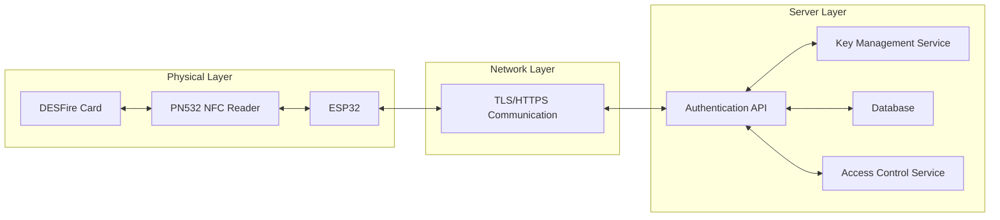
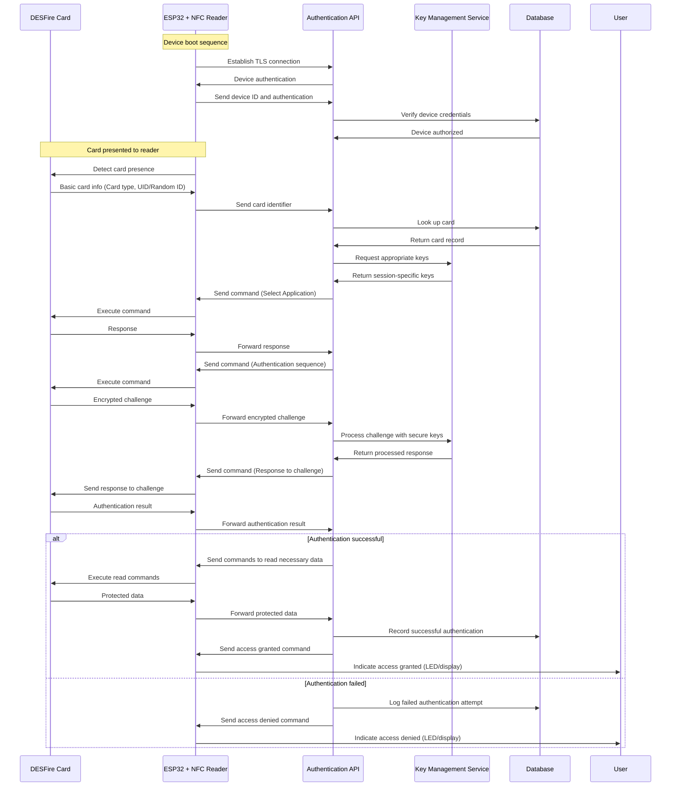
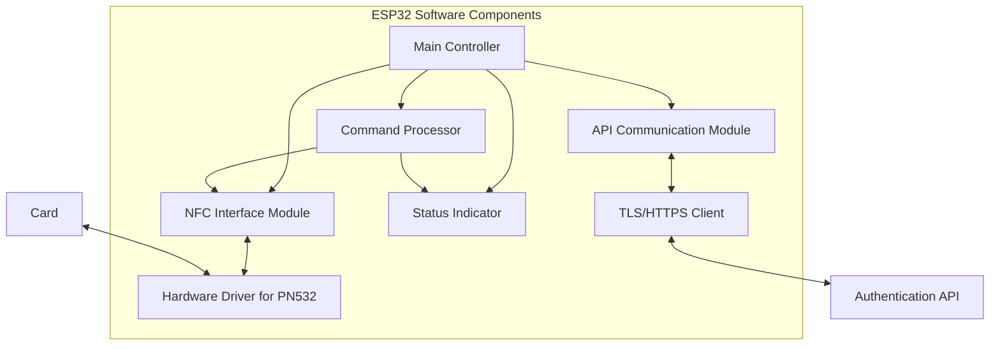
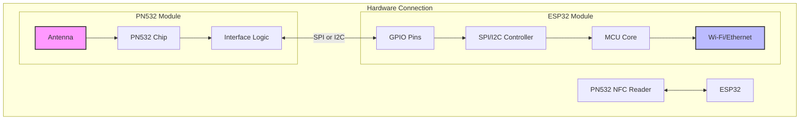
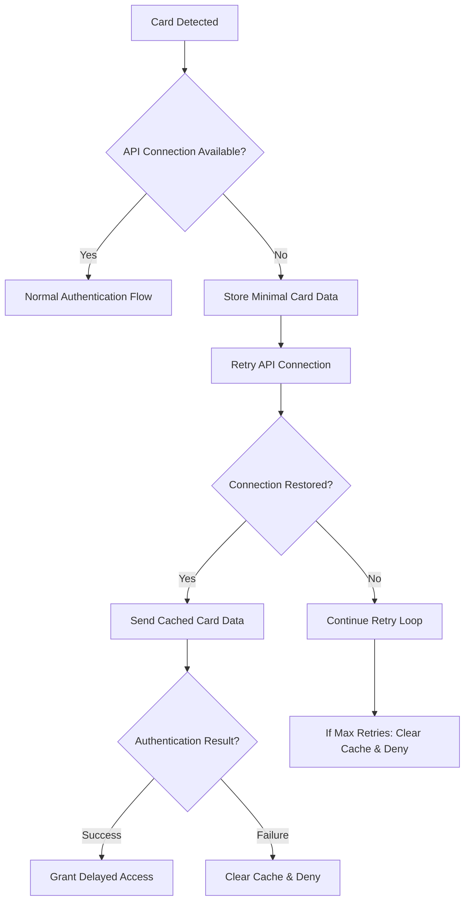

# ESP32 DESFire Proxy Authentication System

This document outlines an architecture for implementing a secure authentication system using:

- ESP32 microcontroller
- NFC reader (PN532)
- DESFire cards
- REST API backend

## Security Design Principles

1. **ESP32 as Secure Proxy**: The ESP32 functions solely as a communication relay between the DESFire card and the authentication API
2. **No Sensitive Data Storage**: No keys, credentials, or other sensitive data are stored on the ESP32
3. **Server-Driven Authentication**: The authentication API controls the entire process and makes all decisions
4. **End-to-End Encryption**: All communication between ESP32 and API is encrypted
5. **Minimal ESP32 Intelligence**: The ESP32 only executes commands as instructed, without understanding their meaning

## System Architecture



## Authentication Flow



## ESP32 Implementation Architecture



## Security Details

### ESP32-API Communication

1. **TLS Connection**:

   - ESP32 establishes a secure TLS 1.3 connection with the API
   - Certificate pinning prevents man-in-the-middle attacks
   - Session-specific keys generated for each connection

2. **API Authentication**:

   - ESP32 authenticates to the API using a device certificate or token
   - Credentials used for authentication are unique to each device
   - Device authentication happens before any card operations

3. **Command Protocol**:
   - All commands from API to ESP32 use a secure protocol
   - Commands include integrity checking (HMAC)
   - Sequence numbers prevent replay attacks

### NFC Operations

1. **Proxy Mode Operation**:

   - ESP32 receives binary commands from API to send to card
   - ESP32 doesn't interpret cryptographic responses
   - ESP32 relays raw responses back to API

2. **Command Isolation**:
   - ESP32 executes one command at a time
   - No command state is stored between operations
   - Timeouts ensure operation doesn't stall

## ESP32 Code Structure

```
/
├── main/
│   ├── main.c                # Main application entry point
│   ├── config.h              # Configuration (non-sensitive)
│   ├── nfc_controller.c      # NFC operations management
│   ├── pn532_driver.c        # Low-level PN532 communication
│   ├── api_client.c          # API communication handler
│   ├── command_processor.c   # Process and execute API commands
│   ├── status_indicator.c    # LED/display feedback
│   └── secure_boot.c         # Secure boot procedures
├── components/
│   ├── esp_https_client/     # HTTPS client library
│   ├── nvs_flash/            # Non-volatile storage (for non-sensitive data)
│   └── esp_tls/              # TLS implementation
└── partitions.csv            # Memory partition layout
```

## Command Structure (API to ESP32)

```json
{
  "command_id": 123,
  "command_type": "card_operation",
  "operation": {
    "type": "transceive",
    "data": "base64_encoded_binary_data_to_send_to_card",
    "timeout_ms": 1000
  },
  "hmac": "signature_of_command_for_integrity"
}
```

## ESP32 Response Structure

```json
{
  "response_to": 123,
  "status": "success",
  "card_response": "base64_encoded_binary_response_from_card",
  "timing_ms": 35,
  "device_status": {
    "rssi": -65,
    "heap_free": 123456,
    "uptime_s": 3600
  },
  "hmac": "signature_of_response_for_integrity"
}
```

## Implementation Steps

1. **ESP32 Setup**:

   - Configure hardware with PN532 NFC reader
   - Implement secure boot to verify firmware
   - Configure Wi-Fi or Ethernet connectivity
   - Set up TLS client with certificate pinning

2. **Authentication API Development**:

   - Implement secure REST API endpoints
   - Create key management system
   - Develop DESFire authentication logic
   - Implement access control policies

3. **Integration Testing**:
   - Verify secure communication between ESP32 and API
   - Test complete authentication flows
   - Perform security penetration testing
   - Validate behavior with various card types

## Security Hardening Recommendations

1. **ESP32 Device Security**:

   - Enable secure boot
   - Encrypt flash memory
   - Disable UART debugging in production
   - Implement tamper detection
   - Configure watchdog timers

2. **Network Security**:

   - Use TLS 1.3 with strong cipher suites
   - Implement certificate pinning
   - Rotate device certificates periodically
   - Rate-limit authentication attempts
   - Monitor for anomalous traffic patterns

3. **API Server Security**:
   - Store cryptographic keys in a hardware security module (HSM)
   - Implement robust logging and monitoring
   - Deploy intrusion detection systems
   - Use role-based access control
   - Regular security audits and updates

## Detailed PN532-ESP32 Connection



## Security Comparison

| Component             | Traditional Approach       | Proxy-based Approach       |
| --------------------- | -------------------------- | -------------------------- |
| **ESP32 Key Storage** | Stores authentication keys | No key storage             |
| **Decision Making**   | ESP32 makes auth decisions | API makes all decisions    |
| **Compromise Impact** | High - keys exposed        | Low - no secrets to expose |
| **Offline Operation** | Possible                   | Requires API connectivity  |
| **Key Rotation**      | Requires firmware update   | API handles key rotation   |
| **Security Updates**  | Requires device update     | Server-side updates        |

## Handling Connectivity Issues



This architecture ensures that all sensitive operations and data remain on the server side, with the ESP32 functioning merely as a secured communication proxy between the DESFire card and the Authentication API.
