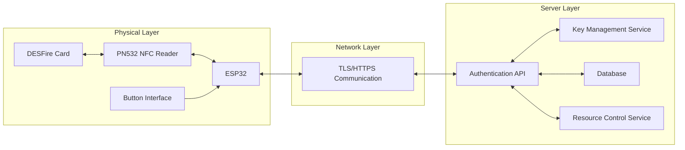
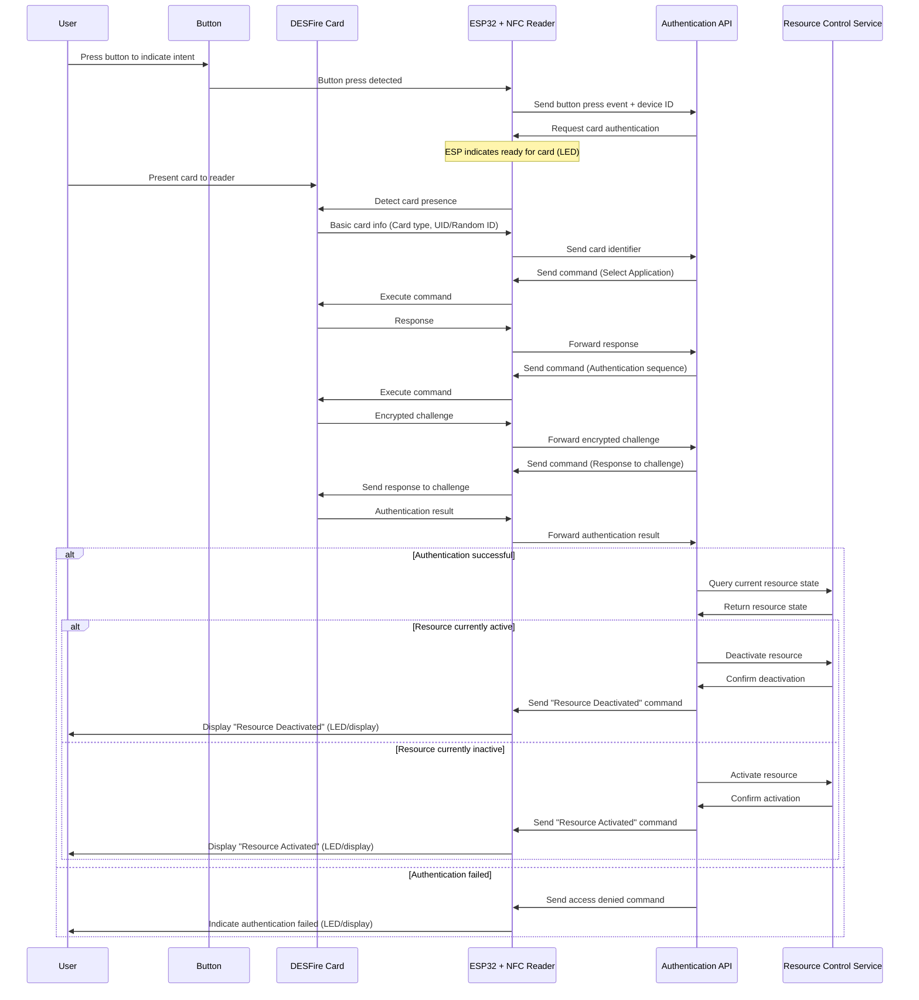
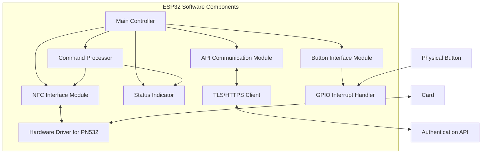
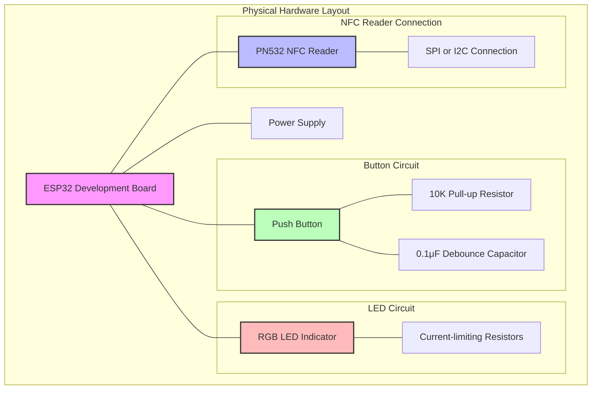

# ESP32 DESFire Resource Control System

This document outlines an architecture for implementing a secure resource control system using:

- ESP32 microcontroller
- NFC reader (PN532)
- DESFire cards (for authentication only)
- Physical button interface
- REST API backend

## System Overview

This system allows users to activate or deactivate resources in an API by:

1. Pressing a physical button to indicate intent
2. Authenticating with their DESFire card
3. Having the API process the resource state change

## Security Design Principles

1. **ESP32 as Secure Proxy**: The ESP32 functions solely as a communication relay between the DESFire card and the authentication API
2. **No Sensitive Data Storage**: No keys, credentials, or other sensitive data are stored on the ESP32
3. **Server-Driven Authentication**: The authentication API controls the entire process and makes all decisions
4. **End-to-End Encryption**: All communication between ESP32 and API is encrypted
5. **Cards for Authentication Only**: DESFire cards are used solely for user authentication, not for storing application data
6. **Intent-Based Actions**: Physical button press required to initiate state change requests

## System Architecture



## Resource Control Flow



## ESP32 Implementation Architecture



## Button Interface Details

1. **Hardware Implementation**:

   - Connect button to ESP32 GPIO with pull-up/pull-down resistor
   - Optionally implement debounce circuit
   - LED indicator near button for user feedback

2. **Software Implementation**:

   - Button press detection using interrupt-based approach
   - Debounce handling in software
   - State machine to track button press events

3. **Security Considerations**:
   - Implement timeout after button press (e.g., 30 seconds to present card)
   - Cancel operation if card not presented within timeout
   - Button press doesn't reveal any sensitive information

## Security Details

### ESP32-API Communication

1. **TLS Connection**:

   - ESP32 establishes a secure TLS 1.3 connection with the API
   - Certificate pinning prevents man-in-the-middle attacks
   - Session-specific keys generated for each connection

2. **API Authentication**:

   - ESP32 authenticates to the API using a device certificate or token
   - Credentials used for authentication are unique to each device
   - Device authentication happens before any card operations

3. **Command Protocol**:
   - All commands from API to ESP32 use a secure protocol
   - Commands include integrity checking (HMAC)
   - Sequence numbers prevent replay attacks

### NFC Operations

1. **Proxy Mode Operation**:

   - ESP32 receives binary commands from API to send to card
   - ESP32 doesn't interpret cryptographic responses
   - ESP32 relays raw responses back to API

2. **Command Isolation**:
   - ESP32 executes one command at a time
   - No command state is stored between operations
   - Timeouts ensure operation doesn't stall

## ESP32 Code Structure

```
/
├── main/
│   ├── main.c                # Main application entry point
│   ├── config.h              # Configuration (non-sensitive)
│   ├── nfc_controller.c      # NFC operations management
│   ├── pn532_driver.c        # Low-level PN532 communication
│   ├── api_client.c          # API communication handler
│   ├── command_processor.c   # Process and execute API commands
│   ├── status_indicator.c    # LED/display feedback
│   ├── button_handler.c      # Button press detection and handling
│   └── secure_boot.c         # Secure boot procedures
├── components/
│   ├── esp_https_client/     # HTTPS client library
│   ├── nvs_flash/            # Non-volatile storage (for non-sensitive data)
│   └── esp_tls/              # TLS implementation
└── partitions.csv            # Memory partition layout
```

## Binary Command Protocol (API to ESP32)

```
Binary Packet Format:

+--------+--------+--------+--------+--------+--//--+--------+--------+--------+--//--+--------+
| MAGIC  | VERSION| CMD_ID |CMD_TYPE|  LEN   | DATA  | NONCE  |HMAC_LEN|  HMAC  |
+--------+--------+--------+--------+--------+--//--+--------+--------+--------+--//--+--------+
  2 bytes  1 byte   2 bytes  1 byte   2 bytes  n bytes 4 bytes  1 byte   m bytes
```

**Field Descriptions:**

- `MAGIC`: Fixed value 0xBA71 (Binary API)
- `VERSION`: Protocol version (starting with 0x01)
- `CMD_ID`: Command identifier (incremental, for tracking)
- `CMD_TYPE`: Command type (0x01=device_auth, 0x02=button_event, 0x10=card_operation, etc.)
- `LEN`: Length of the DATA field
- `DATA`: Command-specific binary data structure
- `NONCE`: Random 32-bit value for replay protection
- `HMAC_LEN`: Length of the HMAC field
- `HMAC`: HMAC-SHA256 of all previous fields (truncated as needed)

**Card Operation Command DATA Structure (CMD_TYPE=0x10):**

```
+--------+--------+--------+--//--+--------+--//--+
|OP_TYPE |TIMEOUT |DATA_LEN| DATA  |CTX_LEN | CTX  |
+--------+--------+--------+--//--+--------+--//--+
  1 byte   2 bytes  2 bytes  n bytes 1 byte  m bytes
```

- `OP_TYPE`: 0x01=transceive, 0x02=select_application, 0x03=authenticate, etc.
- `TIMEOUT`: Operation timeout in milliseconds
- `DATA_LEN`: Length of the card command data
- `DATA`: Raw binary data to send to the card
- `CTX_LEN`: Length of the context data
- `CTX`: Context information (binary packed)

## Binary Response Protocol (ESP32 to API)

```
Binary Packet Format:

+--------+--------+--------+--------+--//--+--------+--------+--//--+
| MAGIC  | RESP_ID| STATUS | LEN    | DATA  | NONCE  |  HMAC  |
+--------+--------+--------+--------+--//--+--------+--------+--//--+
  2 bytes  2 bytes  1 byte   2 bytes  n bytes 4 bytes  32 bytes
```

**Field Descriptions:**

- `MAGIC`: Fixed value 0xBE17 (Binary ESP)
- `RESP_ID`: Response identifier (matches CMD_ID from request)
- `STATUS`: Result code (0x00=success, 0x01=error, 0x02=timeout, etc.)
- `LEN`: Length of the DATA field
- `DATA`: Response data structure
- `NONCE`: Random 32-bit value for replay protection
- `HMAC`: HMAC-SHA256 of all previous fields (truncated as needed)

**Card Operation Response DATA Structure:**

```
+--------+--//--+--------+--------+--//--+
|CARD_LEN| CARD  |TIMING |STATUS_LEN|STATUS|
+--------+--//--+--------+--------+--//--+
  2 bytes  n bytes 2 bytes  1 byte   m bytes
```

- `CARD_LEN`: Length of the card response data
- `CARD`: Raw binary data received from the card
- `TIMING`: Operation execution time in milliseconds
- `STATUS_LEN`: Length of the device status data
- `STATUS`: Device status information (binary packed)

## Binary Protocol Benefits

1. **Efficiency**:

   - Reduced packet size (50-80% smaller than JSON)
   - Lower parsing overhead (no string processing)
   - Faster serialization and deserialization

2. **Performance**:

   - Lower CPU usage for payload handling
   - Reduced memory requirements
   - Lower bandwidth consumption
   - Faster response times

3. **Security**:

   - Harder to interpret without protocol documentation
   - More resistant to injection attacks
   - No need to escape special characters
   - More compact authentication tags

4. **Reliability**:

   - Fixed structure reduces parsing errors
   - Explicit length fields prevent truncation issues
   - Less vulnerable to malformed data

5. **Resource Usage**:
   - Less flash memory usage for code
   - Less RAM usage during operation
   - Reduced power consumption for transmission

The binary protocol can be implemented with careful version control to allow for future extensions while maintaining backward compatibility.

## Simplified API Endpoints

| Endpoint                 | Method | Description                                        |
| ------------------------ | ------ | -------------------------------------------------- |
| `/api/device/auth`       | POST   | Initial device authentication (remains separate)   |
| `/api/desfire/ev1/event` | POST   | Single endpoint for all DESFire EV1 related events |
| `/api/desfire/ev2/event` | POST   | Single endpoint for all DESFire EV2 related events |
| `/api/resource/status`   | GET    | Get current resource state information             |

### Event-Based Communication Pattern

The simplified `/api/desfire/evX/event` endpoints handle multiple event types through a unified interface. Each event includes an `event_type` field in the binary protocol that specifies the nature of the event:

**Event Types:**

- `0x01`: Button press detected
- `0x02`: Card detected
- `0x03`: Card response received
- `0x04`: Error condition
- `0x05`: Device status update
- `0x06`: Heartbeat/keepalive

**Event Data Structure in Binary Protocol:**

```
+--------+--------+--//--+
|EVT_TYPE|EVT_LEN | DATA |
+--------+--------+--//--+
  1 byte   2 bytes  n bytes
```

This event-based approach offers several advantages:

1. **Simplified API surface** - Fewer endpoints to manage and monitor
2. **Stateful conversations** - Events naturally form a conversation flow
3. **Reduced connection overhead** - Can reuse the same connection for multiple events
4. **Easier versioning** - Version changes only affect the path, not the event structure
5. **Improved logging** - All events for a session flow through the same endpoint

The server responds to events with appropriate commands to drive the authentication process forward, maintaining the same security model where the ESP32 acts solely as a proxy.

## System Optimizations

1. **Card Type Detection and Protocol Optimization**:

   - Automatically detect card version (EV1, EV2, EV3)
   - Use optimized command sequences based on card capabilities
   - Provide fallback mechanisms for older card versions

2. **Performance Improvements**:

   - Use binary protocol instead of JSON for ESP32-API communication
   - Implement response caching for frequently used commands
   - Optimize TLS handshake for faster reconnection

3. **Power Consumption Optimization**:

   - Implement sleep modes for ESP32 during idle periods
   - Activate NFC field only when needed after button press
   - Dynamically adjust Wi-Fi power based on signal strength

4. **Memory Management**:

   - Implement fixed-size buffer pools to avoid memory fragmentation
   - Use static allocation for critical components
   - Implement robust out-of-memory handling

5. **Reliability Enhancements**:

   - Implement command retry mechanism with exponential backoff
   - Develop firmware OTA update mechanism with rollback capability
   - Add continuous system health monitoring and reporting

6. **User Experience Improvements**:

   - Add haptic feedback option (small vibration motor)
   - Implement adaptive LED brightness based on ambient light
   - Add sound feedback option for visually impaired users

7. **Security Enhancements**:
   - Implement device attestation to verify authentic ESP32 firmware
   - Add physical tamper detection sensors (optional)
   - Implement secure element support for device key storage if available
   - Measure and report RF field strength to detect potential skimming attacks

## User Experience Flow

1. User approaches the ESP32 device
2. User presses the physical button, indicating intent to change resource state
3. ESP32 LED indicates "Ready for card" (e.g., yellow blinking)
4. User presents DESFire card to the reader
5. During authentication, ESP32 LED indicates "Processing" (e.g., blue blinking)
6. If authentication succeeds:
   - Resource activates/deactivates depending on current state
   - ESP32 LED indicates success (e.g., green solid for activate, green blinking for deactivate)
7. If authentication fails:
   - No state change occurs
   - ESP32 LED indicates failure (e.g., red solid)

## Implementation Steps

1. **ESP32 Setup**:

   - Configure hardware with PN532 NFC reader and button interface
   - Implement secure boot to verify firmware
   - Configure Wi-Fi or Ethernet connectivity
   - Set up TLS client with certificate pinning

2. **Authentication API Development**:

   - Implement secure REST API endpoints
   - Create key management system
   - Develop DESFire authentication logic
   - Implement resource control logic

3. **Integration Testing**:
   - Verify secure communication between ESP32 and API
   - Test complete authentication flows
   - Test resource activation/deactivation
   - Validate button press + card authentication sequences

## Security Hardening Recommendations

1. **ESP32 Device Security**:

   - Enable secure boot
   - Encrypt flash memory
   - Disable UART debugging in production
   - Implement tamper detection
   - Configure watchdog timers
   - Physical security for the button (to prevent unauthorized presses)

2. **Network Security**:

   - Use TLS 1.3 with strong cipher suites
   - Implement certificate pinning
   - Rotate device certificates periodically
   - Rate-limit authentication attempts
   - Monitor for anomalous traffic patterns

3. **API Server Security**:
   - Store cryptographic keys in a hardware security module (HSM)
   - Implement robust logging and monitoring
   - Deploy intrusion detection systems
   - Use role-based access control
   - Regular security audits and updates
   - Implement rate limiting for resource state changes

## Handling Edge Cases

1. **Multiple Rapid Button Presses**:

   - Implement debounce to prevent multiple triggers
   - After initial press, ignore subsequent presses until operation completes

2. **Button Press Without Card Presentation**:

   - Implement timeout (e.g., 30 seconds)
   - Clear intent state if card not presented within timeout
   - Return to idle state with appropriate LED indication

3. **Card Presented Without Button Press**:

   - Optionally perform read-only authentication
   - Do not allow resource state changes
   - Indicate to user that button press is required first

4. **Connectivity Issues After Button Press**:
   - Implement timeout for API connection
   - Clearly indicate connection problem to user
   - Do not cache button press intent for security reasons

## Detailed Hardware Setup



This architecture ensures that all sensitive operations and data remain on the server side, using the DESFire cards purely for authentication. The ESP32 functions as a secured communication proxy with the added functionality of detecting user intent through the button interface.
